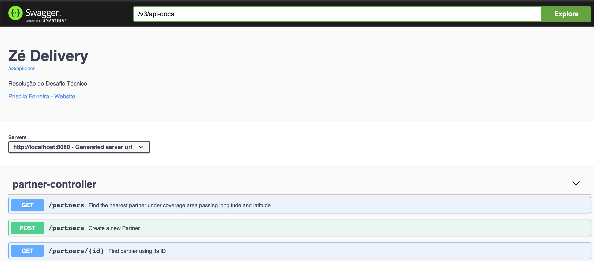
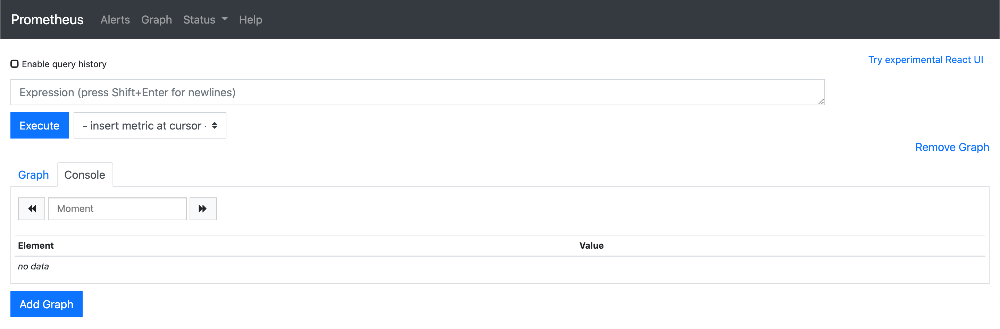
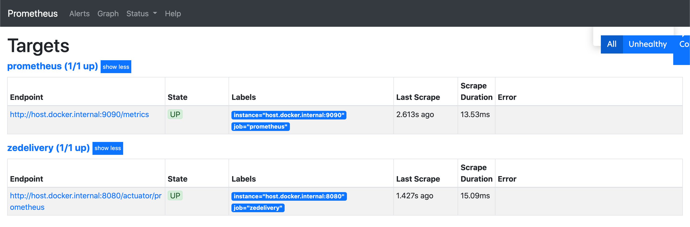
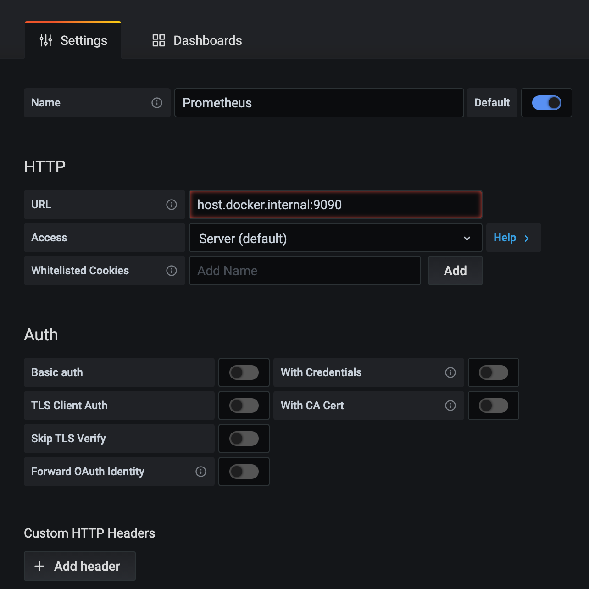
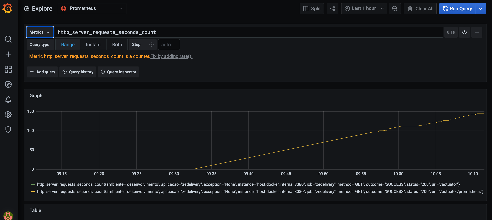
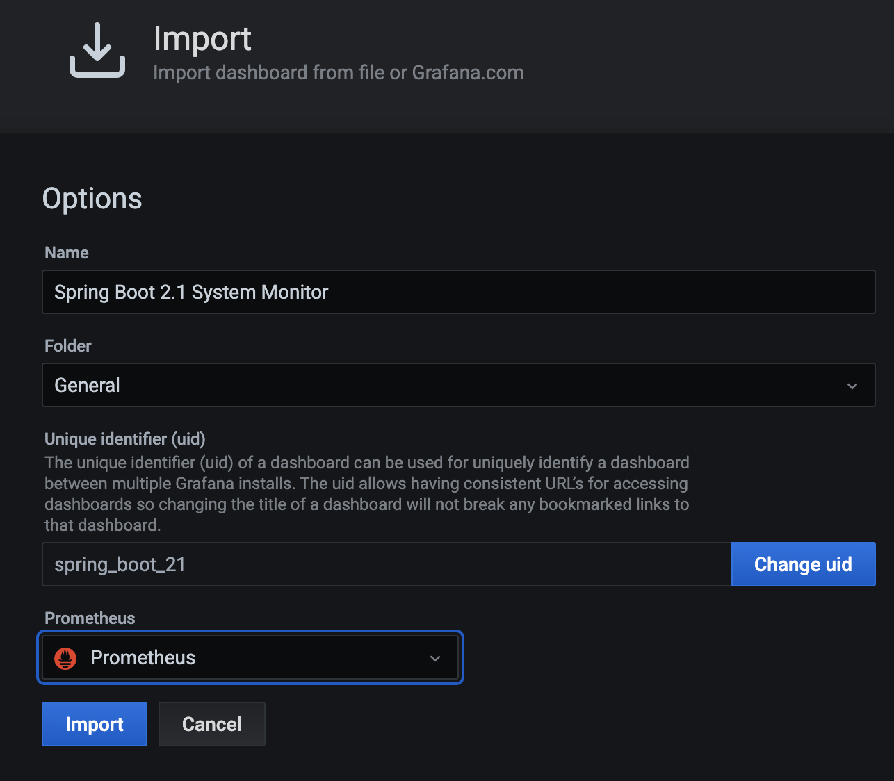
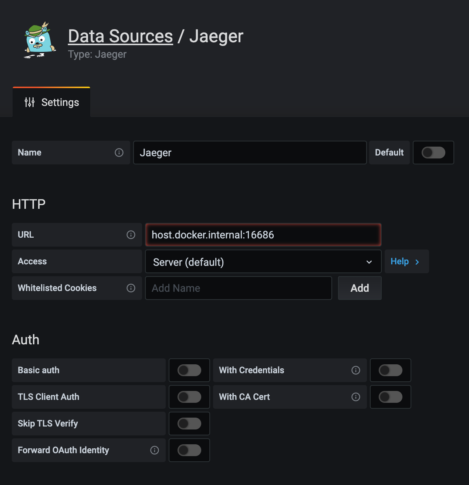
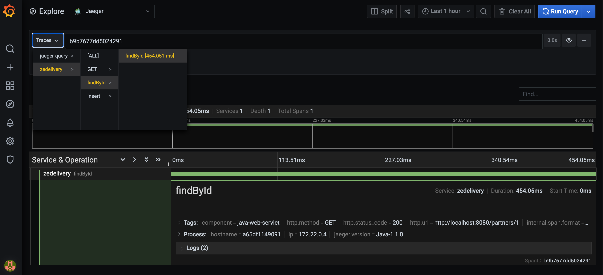

<h1 align="center"><span style="font-size:150%">Zé Delivery</span></h1>

Por [Priscila Ferreira](https://www.linkedin.com/in/priscilasanfer/)

## Ferramentas utilizadas
- Grafana: Análise e Monitoramento
- Prometheus: Monitoramento e alertas
- Swagger: Documentação
- Docker: Conteinerização da aplicação
- Jaeger: Tracing Distribuído

## Configuração do projeto
Obs.: todos os comandos deverão ser executados na raiz do projeto.

- Criar o arquivo .jar do projeto: ``` - mvn clean package```
- Inicializar os serviços: ```docker-compose up --build -d```
- Visualizar se todos os serviços foram inicializados corretamente: ```docker-compose ps```
- Para visualizar log de um container específico: ```docker-compose logs name-container```
- Parar os serviços removendo os containers e os volumes: ```docker-compose down -v```
 
### Swagger
- Acessar a url do Swagger:
```http://localhost:8080/swagger-ui.html```


 
### Prometheus
- Acessar a url do Prometheus: ```http://localhost:9090```
Na página inicial é possível visualizar os endpoints disponibilizados pelo *Actuator*



- Para visualizar o status do serviço: selecione no *menu superior* a opção *Status* -> *Targets*



### Grafana
- Acessar a url do Grafana: ```http://localhost:3000/login```  
default username: admin  
default password: admin 

#### Criando Data Sources
- Em *Configuration* -> *DATA SOURCES* -> *Add data source* -> *Prometheus*
Insira as configurações relacionadas ao Prometheus, como na imagem abaixo.

- Obs1.: Para o meu propósito não vou configurar os outros parâmetros como modelos de autenticação ou tempos de scrape.   
Pois estou rodando em ambiente de desenvolvimento local.   
Mas os outros ambientes devem possuir no mínimo autenticação por senha e proteção via rede. 

- Obs2.:Observe que no campo *URL* informamos a forma como se conectar internamente no container do prometheus.
No meu caso é ```host.docker.internal:9090``` que serve tanto para Mac quanto para Windows.
No caso do linux é possível usar o nome do serviço que está declarado no docker-compose.



#### Visualizando Logs (Prometheus)
- No menu lateral clique na opção *Explore* e selecione o Prometheus.



#### Importando gráficos (Prometheus)
Para usar um dashboard pré-configurado com configurações de métricas padrão reportadas pelo Spring Boot, basta utilizar o arquivo `grafana.json` que se encontra [aqui](./src/main/resources/files/grafana.json)

- No menu lateral clique na opção *Create* -> Import -> Selecione o arquivo disponibilizado e configure conforme imagem abaixo.



### Jaeger
- Para acessar a url do Jaeger: ```http://localhost:16686/```

#### Adicionando database do Jaeger no Grafana
- Siga os mesmos passos feitos para adicionar a database do Prometheus



#### Visualizando os logs (Jaeger)
- No menu lateral clique na opção *Explore* e selecione o Jaeger.

Na opção ```Traces``` é possivel selecionar qual a origem das requests 



### Postman
- [Collection](./src/main/resources/files/Ze%20Delivery.postman_collection.json)

## Testes
Infelizmente não consegui usar outra database para manter as bases separadas.  
Tentei usar o H2gis e até mesmo separar as bases no docker-compose, mas ainda estou aprendendo a trabalhar com geolocalização.

- Para rodar os testes: ```mvn test```
  PS. Isso apagará todos os dados da base de dados.

  
## Próximos passos
- Separar as bases de teste e desenvolvimento 
- Apos separar ambientes ativar o jaeger novamente
- Ajustar o Swagger para mostrar certo os paramentros de geolocalização
- Adicionar segurança com keycloak e Oauth2  
- Fazer deploy no heroku

