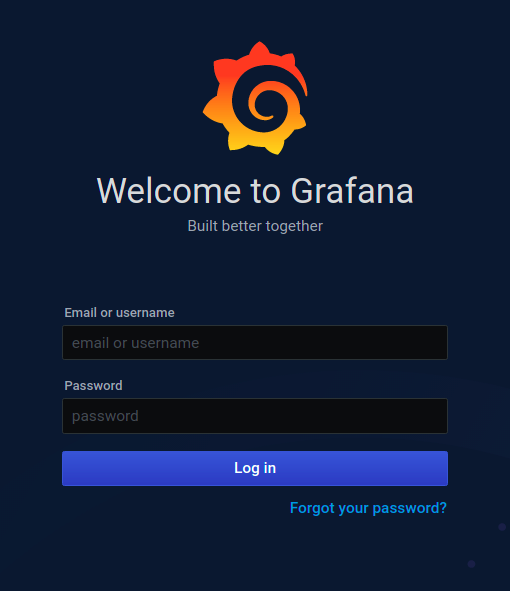

<h1 align="center"><span style="font-size:150%">Zé Delivery</span></h1>

#### <span style="font-size:130%">*Por [Priscila Ferreira](https://www.linkedin.com/in/priscilasanfer/)*  

## Ferramentas utilizadas
- Grafana: Análise e Monitoramento
- Prometheus: Monitoramento e alertas
- Swagger: Documentação
- Docker: Conteinerização da aplicação

## <span>Configuração do projeto</span>
Obs.: todos os comandos deverão ser executados na raiz do projeto.

- Criar o arquivo .jar do projeto: ``` - mvn clean package```
- Inicializar os serviços: ```docker-compose up -d```
- Visualizar se todos os serviços foram inicializados corretamente: ```docker-compose ps```
- Para visualizar log de container específico: ```docker-compose logs name-container```
- Parar os serviços removendo os containers e os volumes: ```docker-compose down -v```
 
## <span>Swagger</span>
- Acessar o Swagger da aplicação:
```http://localhost:8080/swagger-ui.html```


 
## <span>Prometheus</span>
- Acessar a URL do Prometheus: ```http://localhost:9090```

Na página inicial é possível visualizar os endpoints disponibilizados pelo *Actuator*


Selecione no *menu superior* a opção *Status* -> *Targets* para visualizar o status do serviço


## <span>Grafana</span>
- Acessar a URL do Grafana: ```http://localhost:3000/login```  
default username: admin  
default password: admin 
 
   

### Criando Data Sources
- Em *Configuration* -> *DATA SOURCES* -> *Add data source* -> *Prometheus*
Insira as configurações relacionadas ao Prometheus, como por exemplo localização dele na rede.  
Obs1.- Para o meu propósito não vou configurar os outros parâmetros como modelos de autenticação ou tempos de scrape.   
Pois estou rodando em ambiente de desenvolvimento local.   
Mas os outros ambientes devem possuir no mínimo autenticação por senha e proteção via rede.  
Obs2. - Observe que no campo *URL* informamos o nome correspondente ao serviço no *docker-compose* e porta padrão


### Visualizando Logs (Prometheus)
- No menu lateral clique na opção *Explore*

- 

### Importando gráficos (Prometheus)
Para usar um dashboard pré-configurado com configurações de métricas padrão reportadas pelo Spring Boot, basta utilizar o arquivo `grafana.json` que se encontra [aqui](./src/main/resources/files/grafana.json)

- No menu lateral clique na opção *Create* -> Import -> Selecione o arquivo disponibilizado.
Configure conforme imagem abaixo.


